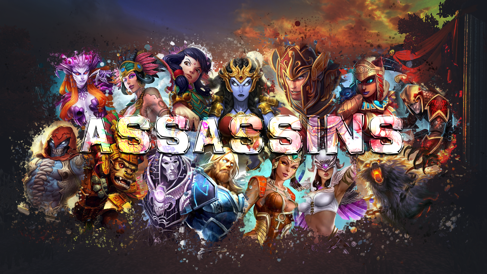

# Online Coach Smite

## Sobre a aplicação

**Online Coach Smite** foi criado com o objetivo de auxilar jogadores
iniciantes e avançados, a alcançarem uma melhor performance no [*Smite*](https://www.smitegame.com/)

## Modo de uso

O jogador entra com o seu *nickname* utilizado no jogo, e será redirecionado para uma página com seus dados de partidas,
sendo eles:

- Vitórias
  - Exibe o quantitativo de vitórias e o percentual em relação as derrotas.
- Derrotas
- Maestrias
- Level
- Conquista Rankeada
- Justa Rankeada
- Duelo

Baseado nos dados do jogador, a aplicação realiza cálculos matemáticos para definir quais vídeos serão exibidos para que
ele possa assistir, e assim melhorar o desempenho durante as partidas.

## Deuses

Na parte dos deuses, a aplicação redireciona o jogador para uma página onde exibe a relação dos [*Deuses*](https://www.smitegame.com/gods) do [*Smite*](https://www.smitegame.com/)

Nessa página, quando o jogador escolher algum Deus, as seguintes informações são exibidas:

- História
  - texto informativo sobre a história de vida do Deus.
- Habilidades
  - relação de habilidades, magias e poderes disponíveis.
- Resultador
  - percentuais de médias de vitórias em combate com o Deus.
- Dica
  - texto informativo de como utilizar o Deus em combate
- Vídeos
  - Exibe vários vídeos para auxiliar o jogador visualmente.

